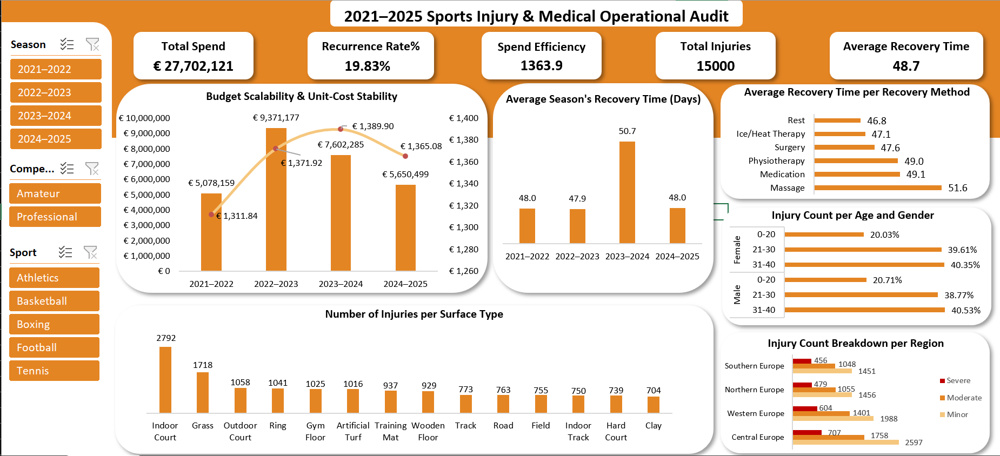

# 2021–2025 Sports Injury & Medical Operational Audit

## 📋 Project Overview
Strategic analysis of 15,000 medical records and a €27.7M budget to evaluate financial efficiency and clinical effectiveness across four seasons.

## 🚀 Key Insights 
* **Financial Stability:** Validated a consistent spend efficiency of **€1,360/1k mins** despite gross budget fluctuations.
* **Anomaly Detection:** Identified a **6.2% spike** in recovery latency in Season 3 driven by high-complexity trauma.
* **Demographic Risk:** Found that **Amateur athletes** account for **70.7%** of injury volume, highlighting a massive opportunity for preventative training ROI.

## 🛠️ Tech Stack
* **Excel:** Data Visualization & UX Design.
* **DAX:** Custom measures for Spend Efficiency & Recurrence Rates.
* **Power Query:** Star Schema modeling and ETL.

## 📂 Repository Structure
* `/Data/`: Star Schema source files.
* `/Dashboard/`: Excel file.
* `/Report/`: Full 2-page S.T.A.R. Technical Report.
