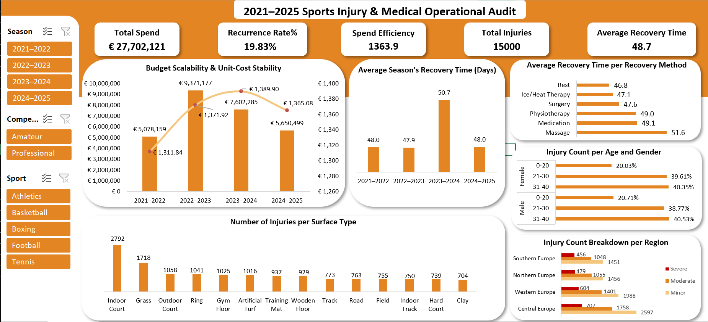

# 2021–2025 Sports Injury & Medical Operational Audit

## 📋 Project Overview
Strategic analysis of 15,000 medical records and a €27.7M budget to evaluate financial efficiency and clinical effectiveness across four seasons.

## 🚀 Key Insights 
* **Financial Stability:** Spend per 1,000 minutes played stayed between **€1,312 and €1,390** (about €1,364 overall) even though seasonal spend ranged from €5.1M to €9.4M.
* **Trend to Monitor:** Average recovery time rose **5.8%** in Season 3 (50.7 vs 48.0 days), within normal variation (p = 0.06).
* **Injury Distribution:** **Amateur athletes** account for **70.7%** of recorded injuries. The dataset has no headcount or exposure data, so this is a share of records, not a risk rate.

## Data Notes
- Dataset: Athlete Health & Injury Dataset, from the FP20 Analytics x ZoomCharts Power BI challenge (August 2025): https://zoomcharts.com/en/microsoft-power-bi-custom-visuals/challenges/fp20-analytics-august-2025
- The data appears synthetically generated (about 20% of injuries per sport, ages evenly spread 16-40, roughly one player, coach and location record per injury), so the findings illustrate the analysis method, not real-world conclusions.
- InjuryID values repeat (INJ-00001 to INJ-05000 appear three times each across the 15,000 rows). The rows are distinct injuries and Total Injuries counts rows.
- The dashboard's age chart uses bands of unequal width (0-20, 21-30, 31-40), so the smaller first band reflects band size, not lower risk.
- The average recovery time chart's vertical axis does not start at zero, which exaggerates the Season 3 difference.

## 🛠️ Tech Stack
* **Ms Excel (Power Pivot):** Data Modeling and Star Schema architecture.
* **DAX:** Engineered custom measures for Spend Efficiency and Recurrence Rates.
* **Power Query:** Star Schema modeling and ETL.
* **Pivot Charts & Slicers:** Interactive UX for multi-dimensional filtering.

## 📂 Repository Structure
* `/Data/`: Star Schema source files.
* `/Dashboard/`: Excel file.
* `/Report/`: Full 2-page S.T.A.R. Technical Report.
